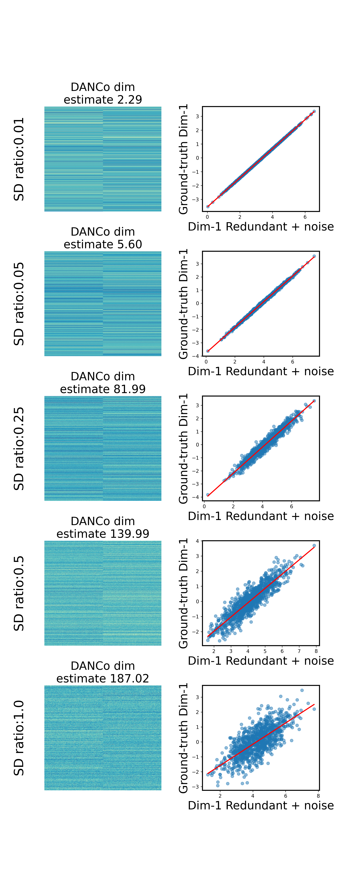

# Do tSNE and UMAP overfit their intrinsic dimensionality
## (The answer, unfortuantely: Yes)

This repository presents an analysis of the intrinsic dimensionality of data that has true dimensions and additional noise dimensions. The primary goal is to explore how various noise levels influence the perceived dimensionality and how different dimensionality reduction methods represent the data.

## Intention

The main intention behind this analysis is to:
1. Generate synthetic data with known "true dimensions" and introduce redundant noisy dimensions.
2. Observe how different dimension reduction techniques, namely t-SNE and UMAP, represent the data with increasing noise.
3. Estimate the intrinsic dimensionality as noise levels increase and analyze its implications.

## Methods Walkthrough

1. **Data Generation**: 
   - We started by creating synthetic data with known dimensions using a random number generator.
   - For each true dimension, redundant dimensions were added. These dimensions were seeded from the true data but had noise introduced, which was controlled by a specified standard deviation ratio (`sd_ratio`).

2. **Dimension Reduction**:
   - For each noise level, dimensionality was reduced using some popular linear & non-linear methods: PCA, NMF, t-SNE, UMAP, and SOM.
   - The reduced dimensions were then visualized against the true dimensions to observe the effects of noise.

3. **Intrinsic Dimensionality Estimation**:
   - At each noise level, the intrinsic dimensionality of the data was estimated using the DANCo method.
   - This helped us understand how perceived dimensionality changes as noise increases.

## Results

Okay - so folks have griped that the "false creation of struction from nothingness" might only happen when you "reduce" from 2 dimentions to 2 dimentions. Of course, that's not the point of dimension reduction - the point is to reduce dimensions.
https://twitter.com/slavov_n/status/1683785160825643008

So - what if the "intrinsic" dimentionality is 2, but there are lots of redundant dimentions? In this situation, we have 2 "real dimentions" that could explain most of the variation in the data. We'll first simulate those 2 "real dimentions" (left hand column in the plots below), then we'll create 100 redundant dimentions per real dimention for our 1000 observations (+variable amounts of noise for the redundant dimentions: rows). So here, the input fed into the algs are actually 1000 rows (observations), with 200 features (columns). But they are generated from 2 main features + variable amounts of noise. Do we still see structure from nothing when we are actually performing dimensionality reduction from 200 features to 2, knowing that the underlying 2 main features are unrelated? Yes. 

From the above figure, we can see that PCA looks similar to the true dimensions. NMF (w/ data shifted up to be non-negative) honestly surprised me here... I don't have a good intuition for why adding noise, creates that elongated shape... ¯\_ (ツ)_/¯. Ideally it wouldn't - it might give the impression that there is some sort of "trajectory" but we see here that just noise can create that illusion.

When we look at the t-SNE and UMAP (default params), we find that they create the appearance of structure from random Gaussian distributions, even when doing a 100 fold dimension reduction, knowing what the true dimensions are. We also see that as noise increases, this structure gets blurier (usurprising, we'll circle back to that). If you're not familiar with SOM, it might look strange, but it just places observations inside of a 2D grid, so that's why it looks uniform; overall it visually looks like it made something Gaussian-ish, but the grid pattern makes it a bit harder to interpret.

You might be balking, thinking that this is still the 2 dims to 2 dims examples. It's not. Below, you'll see the heatmaps of exactly what the input data was. It's clear from the below that we really have our 2 main sources of variation, with varying levels of noise. The scatter plots on the right show the correlation between the main source variable, and an example of one of its 100 redundant features. Note however that, as we increase the spread of the data around this correlation, we really are adding another dimension (imgine an orthogonal line that would cut across, that we'd need to explain this noise). We can see this also if we try to estimate the "intrinsic dimensionality" as noted above the heatmaps.

This plot highlights an interesting phenomenon. As noise levels (or the `sd_ratio`) increase, the estimated intrinsic dimensionality also rises. This resonates with the notion that added noise in one dimension is perceived as adding its own dimension. We can actually explicitly test what the _apparent_ "intrinsic dimensionality" is. We know that there were 2 "main variables", and what we added was noise around those 2 main variables. So what does the intrnisic dimensionality look like when estimated using the [DANCo method](https://doi.org/10.48550/arXiv.1206.3881)?

The challenge lies in deciphering which dimensions are "meaningful" and which are mere noise. But that's the thing... Noise is a dimension. It's just bespoke to each individual variable.

How well do they recapitulate the original observation:observation distances? This is an important question, but one to be interpreted with some degree of caution. In this case we're using random inputs, so the distances should be 1-to-1. But in situations where you have curved space, if your dimension reduction 'flattens' that space, you wouldn't expect it to be 1-to-1; however, you would still expect it to be monotonic, with low variation around the monotonic curve. So what do the results look like? Have a look below (X-axist: True distances (based on 'main' dimensions), Y-axis: Dim-reduced distances):

Unsurprisingly in this case, PCA is bang on, followed by NMF, which has a heteroscedastic pattern, meaning that it preserves very nearby structure a bit better than global. tSNE and UMAP have similar strange patterns and small areas (that likely correspond to the 'cluster' looking structures), which decrease the quality of the conservation of distances. SOM was interesting here, because just looking at the 2D projection, it seemed like it 

## Conclusion

So why then when simulate _only_ orthogonal dimensions, it comes out as blobs?
https://twitter.com/ChenxinLi2/status/1683818705296461830
https://twitter.com/willmacnair/status/1684905102576889856

Well - really - we need to change what we think about dimensionality. Noise _is_ a dimension. It's not an interesting one though... So when you have 100, or 10,000 completely random inputs. The true dimensionality is 100 or 10,000 dimentions. So if you have an algorithm that will overfit every one of them, but in a unique and random way, if we think about the concept of the central limit theorum, those errors, in different random directions, will end up collapsing it back down into a hairball. Now that doesn't mean 

We see this in our own example above as well. As you increase the amount of noise added on top of the "real dimentions" what you're actually doing is adding new, orthogonal (but uninteresting) dimentions. That's why we end up seeing the structure get progressively blurrier. We're actually increasing the intrinsic dimensionality, that can't be captured in a 2D display.

In conclusion: yes - these dimension reduction algorithms overfit their intrinsic dimensionality. But we have now also seen that noise is essentially its own dimension & adding N-observation orthogonal noise dimentions blurs out the overfitting. My interpreation of this is that it's conceptually just the central limit theorum - that adding in many many sources of noise in random directions, causes the overfitting to seem to go away, but it's still there, just getting washed out by all of the other sources of overfitting layered on top.

I'm also happy to be wrong on this - but it's just what the data seems to indicate. The data is the data, as they say...

That's also not to say tSNE/UMAP are completely unrelated to the underlying data! Of course they are. I've used them too. But we _do_ need to be very aware of algorithm assumptions, limitations, and perform negative controls with any method that we use. Especially if it's used for analysis rather than just visualization.

## References

- [Visualizing Data Using t-SNE](https://jmlr.org/papers/v9/vandermaaten08a.html)
- [UMAP: Uniform Manifold Approximation and Projection for Dimension Reduction](https://doi.org/10.48550/arXiv.1802.03426)
- [DANCo: Dimensionality from Angle and Norm Concentration. Camastra & Vinciarelli, 2012](https://doi.org/10.48550/arXiv.1206.3881)

